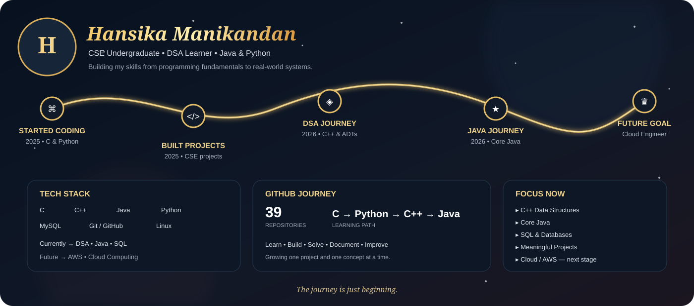

👩‍💻 About Me

Computer Science Engineering undergraduate building a strong foundation in programming, Data Structures & Algorithms, Java, Python and software projects.

🎯 Current Focus

C++ Data Structures & Algorithms

Core Java

SQL & databases

Building meaningful projects

Exploring cloud computing and AWS

🚀 Featured Work

LifeLine — Blood Bank Management System in C

Mission Mangalyaan — DSA / ADT implementations in C++

BirthWatch — Java + MySQL maternal risk monitoring project

Python programming and problem-solving projects

🌠 Career Direction

Programming → DSA → Java → SQL → Cloud → Cloud Engineering

GitHub • LinkedIn
